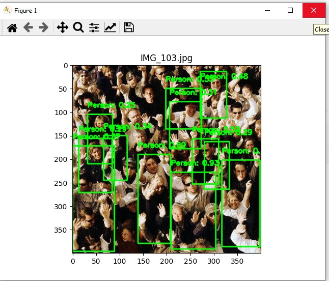
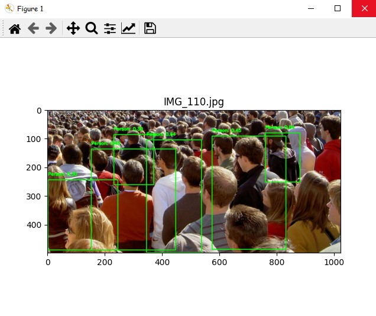

# Crowd Analytics Project

This project utilizes a pre-trained deep learning model to detect and count the number of people in images. It uses a MobileNet SSD model specifically trained for person detection.

## Project Structure

- `annotation_dir/`: Directory containing annotation files.
- `ground_truth.csv`: CSV file with ground truth data.
- `combined_data.csv`: Combined data CSV file.
- `converting_mat_into_csv.py`: Converts all the dataset's `.mat` files to `.csv` files.
- `deploy.prototxt`: Configuration file for the Caffe model.
- `mobilenet_iter_73000.caffemodel`: Pre-trained MobileNet SSD model file.
- `output103.jpg`: Output image showing detected persons.
- `output110.jpg`: Output image showing detected persons.
- `res10_300x300_ssd_iter_140000.caffemodel`: Another pre-trained SSD model file.
- `SSD_v.py`: Main SSD code Python file.

## Requirements

- Python 3.x
- OpenCV
- NumPy
- Matplotlib

You can install the necessary Python packages using:

**Installing Dependencies:**
    ```
    pip install opencv-python numpy matplotlib
    ```

## How to Use

1. **Install Dependencies:** Ensure you have the necessary libraries installed.

2. **Set Up Paths:** Update the `model_path`, `config_path`, and `dataset_dir` variables in the `SSD_v.py` file with the correct paths to your model files and image dataset.

3. **Run the Code:** Execute the Python script to analyze each image in your dataset, display the results, and print the number of persons detected in each image:

    ```sh
    python SSD_v.py
    ```

## Code Explanation

The code in `SSD_v.py` performs the following steps:

- **Load the Model:** The code loads the pre-trained MobileNet SSD model from the specified paths.
- **Define the `detect_persons` Function:** This function takes an image as input and:
  - Preprocesses the image: Resizes the image and converts it to a blob.
  - Runs inference: Passes the blob through the loaded model to obtain detections.
  - Filters detections: Identifies detections with a confidence score above 0.2 and verifies they correspond to the 'person' class (index 15 in COCO dataset).
  - Draws bounding boxes: Draws bounding boxes around detected persons on the image.
  - Counts persons: Counts the number of detected persons and returns the image with bounding boxes and the

total count.
- **Image Analysis:** The code iterates through all images in the specified directory:
  - Loads the image: Reads each image file.
  - Detects persons: Calls the `detect_persons` function to perform person detection.
  - Displays results: Displays the image with bounding boxes and prints the number of detected persons.

## Output Images

Sample output images with detected persons:

- `output103.jpg`
  
- `output110.jpg`
  

## Improvements

- **Performance:** Experiment with different model sizes and optimization techniques to improve the model's speed and accuracy.
- **Real-time Analysis:** Adapt the code to work with live video feeds for real-time crowd analysis.
- **Data Augmentation:** Augment the training dataset to improve model robustness.

## Disclaimer

This project is for educational purposes only. The accuracy and performance of the model may vary depending on the quality of the dataset, the model's training, and the complexity of the scenes. It is important to note that this is a simplified example and may not be suitable for critical or high-stakes applications.
